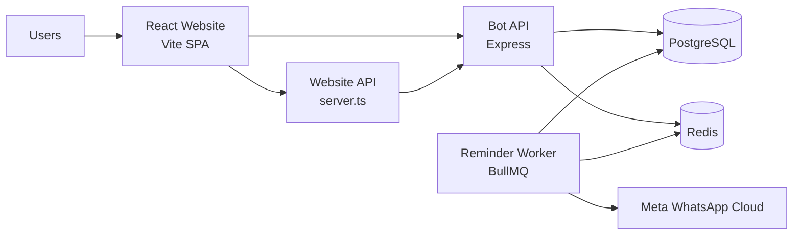
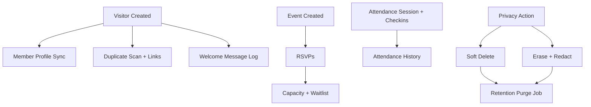

# FGC Upper Room Mgbuoba Website v2.0

React website, admin center, attendance flow, and WhatsApp bot for FGC Upper Room Mgbuoba, the youth fellowship of Foursquare Gospel Church, Mgbuoba Zonal HQ.

## 🚀 Quick Start

```bash
npm install                  # Install dependencies
npm run dev                  # Start backend services (media API + bot + worker + attendance)
npm run dev:web              # Start website only (localhost:3000)
npm run env:parity           # Verify env template parity (dev/staging/prod)
npm run ops:backup-drill     # Run PostgreSQL + Redis backup/restore drill
```

## 📦 What's Inside

- **Website**: Multi-page React app with media, blog, events, contact, and live/VOD pages
- **WhatsApp Bot**: Service reminders, event notices, and opt-out handling with Redis queue workers
- **OpenClaw Sidecar (Optional)**: Operator-facing AI gateway that can ingest bot alert digests
- **Admin Center**: Content management at `/admin` for events, media, blog posts, and records
- **YouTube Integration**: Auto-sync sermons from the church channel
- **Online Giving**: Paystack-based one-time donations with webhook confirmation and admin records
- **Full-Stack**: Express + Vite with TypeScript support in the API layer

## 📁 Project Structure

```
src/
├── pages/               # Public routes + Admin center
│   ├── Home/            # Landing page with hero & countdown
│   ├── Media/           # Advanced gallery with filtering & pagination
│   ├── Blog/            # Articles, devotionals, Sunday school
│   ├── Events/          # Upcoming programs
│   ├── Admin/           # 🔒 Content management (events, media, blog)
│   └── ...
├── components/          # Reusable UI & layout components
bot/
├── src/                 # WhatsApp bot backend
│   ├── routes/          # API endpoints (visitors, events, messages)
│   ├── services/        # WhatsApp, LLM, analytics services
│   └── workers/         # Queue workers for reminders
└── db/schema.sql        # PostgreSQL database schema
```

## 🧭 Architecture Diagrams





## 🎨 Key Features

### Website
- **Media Gallery**: Category filtering (Sermons, Youth, Events, Audio), date ranges, pagination, YouTube embeds, multi-asset lightbox
- **Blog**: Articles, devotionals, Sunday school materials with categorization
- **Events**: Countdown timers, registration forms, event details
- **Admin Center** (`/admin`): Create/manage events, upload media, publish blog posts, and review bot reminders, imports, and delivery logs

### WhatsApp Bot
- **Service Reminders**: Automated Saturday 12 PM notifications (first Sunday 07:30, others 08:00)
- **Event Notifications**: Weekly reminders starting 1 month before events
- **LLM-Powered**: Personalized messages via Vertex AI, OpenAI, or Gemini
- **Opt-Out Support**: Automatic STOP detection and suppression list

## 🎨 Brand Colors

```css
--cross-red: #8a161e;     /* Savior */
--dove-yellow: #d4a82e;   /* Baptizer */
--cup-blue: #2d3a7a;      /* Healer */
--crown-purple: #5a4494;  /* Coming King */
--main-cream: #e8dfc5;    /* Background */
```

## ⚙️ Configuration

Copy `.env.example` to `.env` and fill in the values that match your setup. Keep the root template and the three files under `env/` in sync with `npm run env:parity`.

For bot secrets and deployment notes, use:
- [`bot/ENV_SECRETS_SETUP.md`](bot/ENV_SECRETS_SETUP.md)
- [`bot/DEPLOYMENT.md`](bot/DEPLOYMENT.md)
- [`bot/BACKUP_RECOVERY.md`](bot/BACKUP_RECOVERY.md)

If you deploy the app under a subpath, set `APP_BASE_PATH`, `PUBLIC_APP_BASE_PATH`, and `VITE_APP_BASE_PATH` together. A few keys you will touch often are `BOT_PORT`, `DATABASE_URL`, `REDIS_URL`, `BOT_ADMIN_API_KEY`, `VITE_ENABLE_ADMIN_FALLBACK_LOGIN`, `PAYSTACK_PUBLIC_KEY`, `META_ACCESS_TOKEN`, `LLM_PROVIDER`, `VITE_BOT_API_URL`, and `VITE_RUM_ENDPOINT`.

See [`OPERATIONS.md`](OPERATIONS.md) for QA, observability, schema, and recovery notes.
OpenClaw templates and policy map: `openclaw/gateway.example.jsonc`, `openclaw/bot-api-policy.json`.
Edit `src/pages/Team/Team.jsx` with real names and photos

## 🌐 Deployment

This project deploys automatically via **GitHub Actions**.

- Push changes to a feature or update branch and open a **Pull Request**
- Once merged to `main`, the site updates automatically

See [CONTRIBUTING.md](CONTRIBUTING.md) for how to contribute.

---

**"Raising Kingdom Youths!"**

*Jesus Christ the same yesterday, and today, and forever. - Hebrews 13:8*
